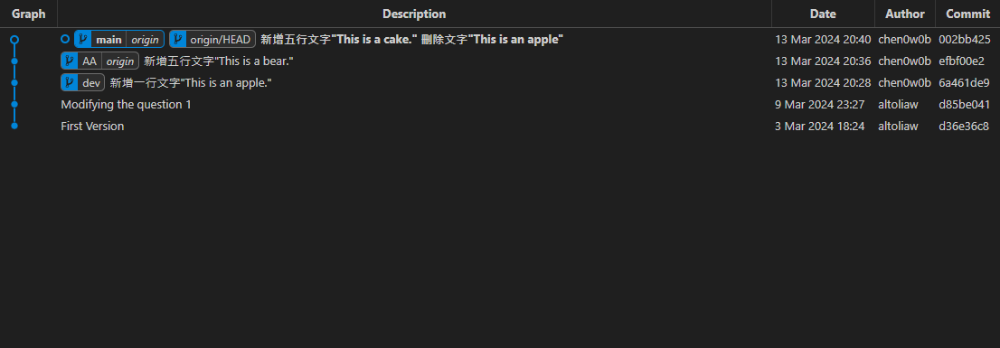

# 第1次作業-作業-HW1
>
>學號：111111116
> 
>姓名：劉泳辰
> 
>作業撰寫時間：180 (mins，包含程式撰寫時間)
> 
>最後撰寫文件日期：2024/04/02
>

本份文件包含以下主題：(至少需下面兩項，若是有多者可以自行新增)
- [x] 說明內容
- [x] 個人認為完成作業須具備觀念

## 說明程式與內容

1.請作完上述後，將git graph的線圖進行截圖，給予檔名為answer.png，並完成answer.md檔案，並一併於main分支內進行add、commit並push至伺服器倉庫中即可。

2.請將亞東紀念醫院 : 網路掛號 (femh.org.tw)系統打開後，隨便對某一科別於所撰寫時間的下一周，進行掛號(掛完號後記得再進行取消)，並將每個步驟進行截圖並說明每份截圖意義。

**圖1.** 網路主要掛號功能的頁面，可以線上掛號，查詢掛號以及其進度。

**圖2.** 掛號科別頁面，可以以身體問題去選擇掛號的科別。

**圖3.** 選擇想掛號的周次，時間及日期來查詢該日期時段是否可以掛號

**圖4.** 選擇想掛號的周次，時間及日期

**圖5.** 如果是初診的話要填寫個人基本資料。

**圖6.** 確認就診位置以及診別(備註：這裡寫複診是因為之前已經註冊過一次)

**圖7.** 確認就診序號、地點和需要攜帶的物品。

## 個人認為完成作業須具備觀念

開始寫說明，需要說明本次作業個人覺得需學會那些觀念，亦可作為學習筆記使用 (需寫成文章，需最少50字，並且文內不得有你、我、他三種文字)

第一題需要瞭解git相關的指令，修改檔案，開分支，合併分支和繳交，而且還需要用Git Graph查看每次push完之後的紀錄及日誌

第二題則是需要瞭解網路掛號的每一步流程的意義。

